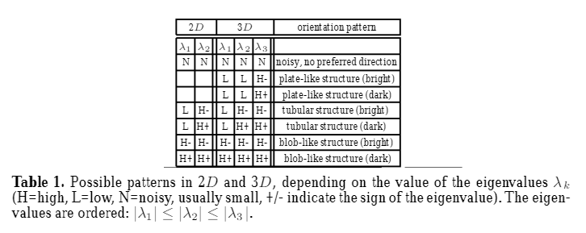
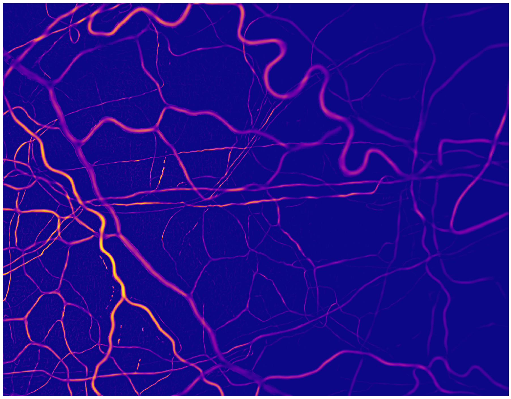
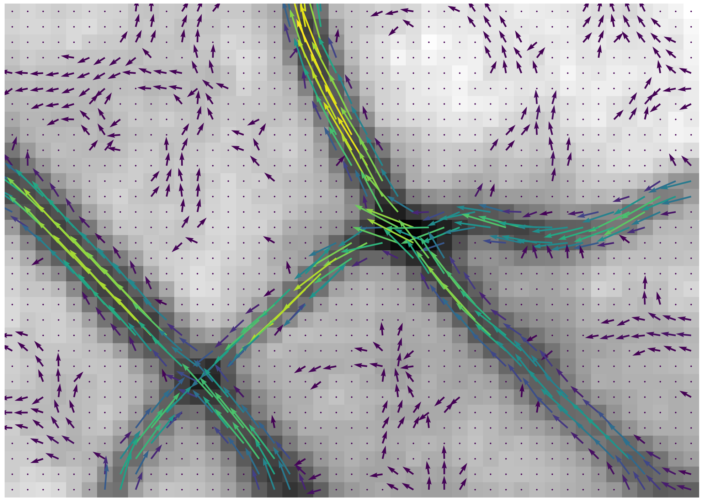
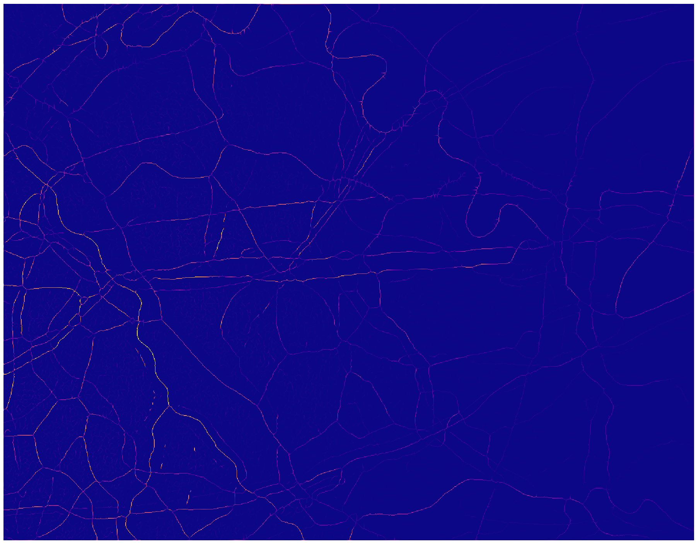
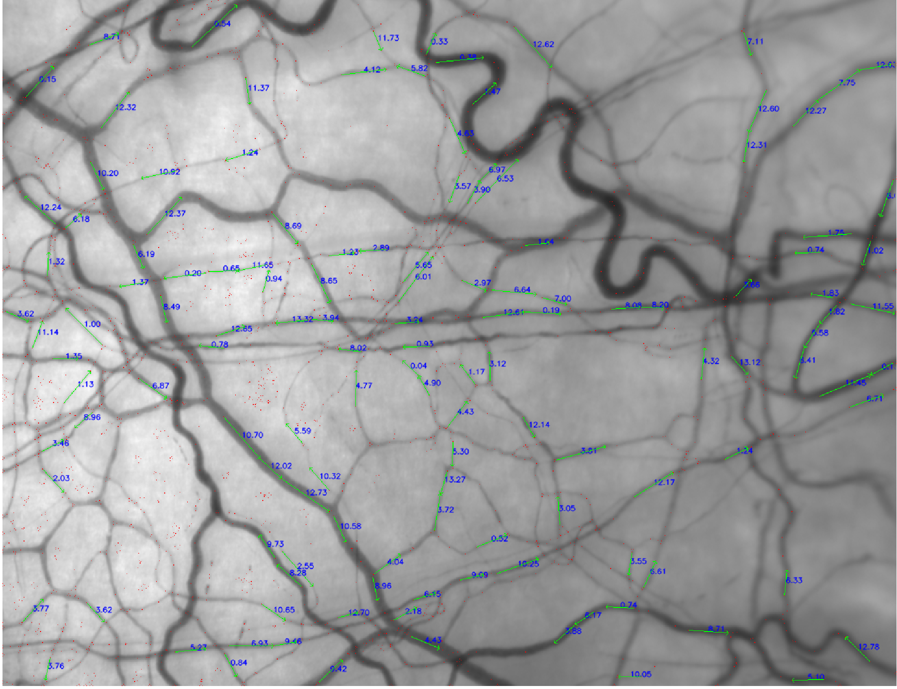

# Vessel Analysis Tool


## Features

1. General frame and video input and output

2. Stabilisation

3. Vesselness filtering

4. Skeleton and graph representation of network

5. Limited flow analysis

   

## Requirements

- Python 3
- Python packages:
  - numpy, scipy, matplotlib - built in to anaconda.
  - [OpenCV](https://opencv-python-tutroals.readthedocs.io/en/latest/py_tutorials/py_tutorials.html)  - `pip install opencv-python`  - for image processing.
  - [NetworkX](https://networkx.github.io/documentation/stable/) - `pip install networkx` - for its graph data structure.
  - [Thinning](https://pypi.org/project/thinning_py3/) - `pip install thinning_py3` - for its quick and easy implementation of the Guo-Hall Thinning Algorithm.


OpenCV stores images as an array of unsigned bytes, with intensity values from 0-255. The dimensions are y, then x, then either a ubyte or a triplet of ubytes in a final dimension for colour (BGR). They are numpy-compatible, and so a lot of operations are done with numpy for speed. OpenCV also has some specific image-manipulation functions which can be useful. Matplotlib can show images with floating-point intensity values in any range, but `rescale_to_ubyte` should be used before saving anything or using most OpenCV functions.


***

## 1. General frame and video input and output (`frame_io.py`)

### Description

This module contains several functions to read sequences of frames, and save them as frame sequences or videos.

The assumed file structure is something similar to this:

> overall project folder
>
> > set of frames 1
> >
> > > unstabilised
> > >
> > > > img00001.---
> > > >
> > > > img00002.---
> > > >
> > > > etc.
> > >
> > > some_processing_afterwards
> > >
> > > > img00001.---
> > > >
> > > > etc.
> > >
> > > output1.bmp
> > >
> > > output2.avi
> >
> > set of frames 2
> >
> > etc.

Each video has its own folder, which contains one or more subfolders that have frames in them stored as a sequence of images. 

A universal frame filename structure is assumed and stored in FRAME_FILENAME_TEMPLATE (currently of the form 'hvi-video-00001' etc.)

### Functions:

```python
''' read an individual frame.
	- file name structure given by FRAME_FILENAME_TEMPLATE.
	- folder path and file extension need to be provided only
	  once in the program.'''
def read_frame_i(i, input_folder=None, input_extension=None):

''' read a range of frames from start_n to end_n-1 inclusive.'''
def get_frame_range_from_folder(input_folder, input_extension, start_n, end_n):

''' read all frames from a folder.
	assumes the folder only contains ordered images of same res.'''
def get_frames_from_folder(input_folder):

''' write frames to video given by out_path.
	currently unable to do lossless compression. '''
def write_video_from_frames(frames, out_path):

'''	save frames into folder at folder_path.
	creates this folder if it doesn't exist.
	filenames are according to FRAME_FILENAME_TEMPLATE.
	frame numbers are sequential, starting from start_n(=0). '''
def save_frames_to_folder(frames, folder_path, start_n=0):

'''	for the purpose of testing stabilisation 'live'. '''
def sim_async_input(frames, framerate, print_timing=False):
```

### Limitations/improvements

This is a very simple utility module which can be adapted easily if necessary.


***

## 2. Stabilisation (`stabilise.py`)

### Description

This module contains functions to stabilise frame sequences, with various options provided. The registration and transformations are implemented in a generator function, `yield_stabilised`, so that the program could in future be run on a live feed of frames. The main function expected to be called is `simple_stabilisation`, which is effectively a wrapper for `yield_stabilised`. Stabilisation mostly uses built-in OpenCV functions, which seem to be sufficient.

#### Algorithm

- The first frame supplied is chosen to be the reference frame.
- Strong corner features are identified as keypoints in a downscaled version of the reference frame with `cv2.goodFeaturesToTrack` (which detects corners based on their eigenvalues at different scales).
- For each successive frame:
  - Downscale 8x.
  - Use `cv2.calcOpticalFlowPyrLK`, which employs the Lukas-Kanade optical flow algorithm to register keypoints between the reference frame and the current frame. The same feature detection algorithm is used internally as for the reference frame.
  - Estimate the similarity transform between found matched points with `cv2.estimateAffinePartial2d` (if fewer than 30% of keypoints matched, give up.)
  - Adjust transformation matrix parameters back to the scaled-up image, and apply using `cv2.warpAffine`.
  - Check effectiveness by calculating a correlation coefficient ('score') of the Laplacian of the images (which should be invariant to brightness and contrast).
  - If the score is below a threshold, use this as the new reference frame, and signal a new stabilised sequence start by returning `None` in place of the score.
  - If a cropped version is required, also apply the transform to an all-white-pixel mask and return it too.
- If a cropped version is required, for each stabilised sequence, find the largest upright rectangle which fits within all of the masks, and crop the images to that region.

#### Parameters/options for `simple_stabilisation`

- `crop`  - if `False`, pad with zeros up to full resolution, otherwise crop to the minimum upright rectangle which is common to all of the frames for each frame sequence.
- `ignore_score` - if not `None`, do not return frames with a correlation score below its value (but do not split into multiple sequences). Mutually exclusive with `split_score`.
- `split_score` - if not `None`, start a new frame sequence each time the correlation score falls below its value. Mutually exclusive with `ignore_score`.
- `downscale` - if not `None`, how much to downsample by during registration. Higher resolutions are slower computationally and seem to occasionally be affected by the motion of blood cells, causing minor rotations.
- `mark_keypoints` - if `True`, draw on the output frames the keypoints used for matching.
- `correspondence_filter` - if not `None`, supply a function to be used just before registration - e.g. a function which masks a portion of the frame that contains a needle which would disrupt registration.

### Functions

```python
''' find upright rectangle containing only preserved pixels. '''
def find_max_preserved_rect(border_mask):

''' register two frames and find transform to stabilise them. '''
def get_transform(frame, frame0, p0, downscale, mark_keypoints=False):

''' generator which yields successive stabilised frames. 
	This is the core operation which would be used in the case of live stabilisation. '''
def yield_stabilised(frames, split_score=0.3, crop=False, downscale=8, mark_keypoints=False, registration_filter=None):

''' apply stabilisation to frame array. See above for details. '''
def simple_stabilisation(frames, ignore_score=None, split_score=None, crop=False, downscale=8, mark_keypoints=False, registration_filter=None):


''' This was an attempt to detect relative motion of conjunctival
	and scleral vessels and is based on an older version of the
	simple_stabilisation function. 
	Kept because it is a kind of proof-of-concept. '''
def two_layer_stabilisation(frames, similarity_threshold=0):
```

### Limitations/improvements

The built-in functions from OpenCV appear to be sufficient for stabilisation when there is no relative motion of the conjunctival and scleral vessels, although pre-registration filters could be experimented with. It is fast enough to do it live, and the `yield_stabilised` function has been written in a way to potentially facilitate this.

I had a stab at separating the relative motions with`two_layer_stabilisation`, and while it wasn't very effective, it seems possible to do. In order to improve it, the motion of cells along vessels needs to be ignored. A possible route forward could be using the built-in dense optical flow algorithm `cv2.calcOpticalFlowFarneback`, and using Hessian eigenvectors from `vessel_filter.py` to consider only the components of flow perpendicular to vessels - hopefully this could be used without having to resort to implementation of the full algorithm in C++, which would likely be very slow (although the time taken to compute Hessian eigenvectors would already make it too slow for live usage).


***

## 3. Vesselness Filtering (`vessel_filter.py`)

### Description

This module implements a Frangi vesselness filter. It also unsuccessfully attempts to implement the Vessel Enhancing Diffusion (VED) algorithm from: _'Vessel Enhancing Diffusion: A scale space representation of vessel structures'_ (Manniesing et al.) . (The `anisotropic_blur` function attempts to replicate the effect, but doesn't give good results).

#### Algorithm

- A Hessian matrix is calculated for each pixel of the input image at several scales.
- The eigenvalues are found and sorted by magnitude. Vessel-like structures have one large eigenvalue and one small, positive eigenvalue for images with dark vessels on a bright background (see table).
- A vesselness score between zero and one is computed according to 'stretchedness' and 'feature strength' scores as described in the Frangi paper.
- The maximum vesselness score is computed for each pixel across all scales.

***

Image: From _Multiscale vessel enhancement filtering_ (Frangi et al.)



***

#### Parameters/options for `apply_frangi`

- `sigmas ` - an array containing each of the scales to evaluate vesselness at.
- `beta` - stretchedness importance factor. The larger it is, the lower stretched features (with a large difference between eigenvectors) are scored.
- `gamma` - feature strength importance factor. The larger it is, the lower strong features (with large eigenvalues) are scored. If set to `None`, this is set to half of the maximum score at each scale.
- `c` - only used for well-posedness of diffusion equation in VED algorithm where it is set to a small value. Can be set to `0`/`None` otherwise.
- `scale_dependence` - response at each length scale is adjusted by raising it to minus this power, before the maximum is computer, in case a stronger output is desired from smaller/larger scales. Derivative kernels have already been normalised so when set to `0`, response is uniform over scale.
- `return_eigens` - return the eigenvectors and eigenvalues of Hessian at maximum response. This is required in the unused VED functions. However, it can also be useful in future functions, as a vector field is returned giving strength and direction of vessel features.

### Functions

```python
''' calculate and return Hessian matrix of the image 
	for each pixel at a particular scale sigma.'''
def get_hessian(img, sigma, force_separable_diff=False):

''' compare Hessian eigenvalues at each pixel to give a 'vesselness' score. '''
def get_vesselness(hessian, beta=1, gamma=15, c=None):

''' apply a Frangi vesselness filter to the frame, taking the maximum response
	for each pixel over the range of scales given by sigmas.'''
def apply_frangi(frame, sigmas=[1,2,3,5], beta=1, gamma=None, c=None, scale_dependence=0, return_eigens=False):


#---------------------- unused functions: ----------------------#
''' initial attempt at filtering images.
	not particularly theoretically justified but does an OK job.
	better methods are below. '''
def filter_raw_img(grey):

''' test application of anisotropic_blur '''
def test():

''' this function does seem to blur as intended in tests but it doesn't give good results. '''
def anisotropic_blur(frame, vesselness, w, omega=2, epsilon=0.01, sensitivity=1, kernel_rad=3, cos_scale=0):

''' this function doesn't work.
	D tensor construction is fine but application of diffusion equation
	leads to instabilities - sharp black and white 1-pixel-wide bands '''
def VED_step(frame, vesselness, e_vecs):
```

### Limitations/improvements

Making the `anisotropic_blur` or `VED_step` functions work properly would hopefully greatly improve the filtering. `anisotropic_blur` seems to correctly blur in a direction according to vessel boundaries, but still does too much transverse blurring. In its current form the fading of background features is just because the border is preserved which affects the distribution of vesselness scores. Correcting the `VED_step` function may require subpixel simulation of diffusion.

Currently I have moved most of the filtering of background noise towards the skeletonisation process and manipulation of the graph, and there are several ways that the process can be improved there instead.

***

Image: output of Frangi filter for a full image, colour-mapped by vesselness score.



Image: output of Frangi filter in a small area, with dominant eigenvectors superimposed.




***

## 4. Skeleton and graph representation of network (`skeleton.py`)

### Description

This module contains methods to extract the morphology of the vessels, via thinning vessels down to a 'skeleton', constructing a graph based on the skeleton connectivity, and performing some filtering to remove noise artefacts.

***

Image: skeletonised output of Frangi filter.



***

The three formats used throughout the module are:

- _skeleton_, which is a grayscale image of one-pixel-wide vessels where intensity corresponds to vesselness score

- _features_, which consists of three separate grayscale image of a skeleton split into _joints_ (branch points), _ends_ (vessel segment endpoints) _edges_ (vessel segments, i.e. the remainder of the skeleton)

- _graph_, which is a NetworkX graph which contains:
  - nodes, with attributes `"type"` (`"joint"` or `"end"`), `"score"` (max intensity value), and `"contour"` (array of the component pixels)
  - edges, with attributes `"score"` (max intensity value), `"contour"` (array of the component pixels),` "length"` (length in pixels), and if `make_graph_line_chains` has been called, `"point chain"` (series of points which approximate the contour when straight lines are drawn between them)

The intended processing order is:

* First skeletonise a filtered image with `skeletonisation `,
* Obtain a graph with `skel_to_graph`,
* Simplify the graph with `simplify_graph`,
* Perform any other filtering manually or with `filter_graph_edges`,
* If required, order pixels with `order_graph_cnt_pixels` then call `make_graph_line_chains` **after** to obtain line approximations.

#### Algorithms

- `skeletonisation` and `features_to_skel` make use of the Guo-Hall thinning algorithm from the package `thinning`.
- `skel_to_features`:
  - done via convolution for speed (as OpenCV operations are in c): convolve with 3x3 kernel of all ones and a 10 in the middle. The 10 allows us to only consider output pixels > 10 so that only white pixel centres are considered.
  	- single pixels (islands) are removed.
  	- pixels connected to 1 other are considered ends (thresh: >10 but not >11)
  	- pixels connected to 2 others are considered edges (thresh: >11 but not >12)
  	- pixels connected to 3+ others are considered joints (thresh: >12). 
- `features_to_graph`
  - a dictionary, `pixel_map`, is constructed mapping joint and end pixel locations to a unique ID for each joint.
  - the neighbours of each edge pixel are searched. If one is contained within `pixel_map`, the edge is considered connected to that joint ID.
  - a graph is then constructed using this data.

#### Parameters/options 

##### for `graph_to_skel`

- `simplify` - if `True`, dilate the nodes and then the entire skeleton before re-thinning to get rid of mini spurs that lead to joints which needlessly break up edges and connect gaps.

##### for `simplify_graph `

- `params` - an array which should contain three sub-iterables of the same length, corresponding to the number of iterations of processing:
  - First component: passed to `spread_scores`. Contains integers dictating the number of times to apply `spread_scores` in each loop
  - Second component: passed to `prune_graph`. Contains six-component iterables, containing criteria for pruning, of the form `(min_spur_length, keep_spur_score, remove_spur_score, min_free_segment_length, keep_free_segment_score, remove_free_segment_score)`, where:
    - a `spur` is and edge with a joint on one side and an end on the other
    - a `free segment` is an edge with an end on both sides
    - an edge shorter than `min_length` requires a `"score"` of at least `keep_score` to avoid being removed
    - an edge with a `"score"` below `remove_score` is removed.
  - Third component: passed to `graph_to_skel`. Contains booleans dictating whether `graph_to_skel` should simplify the skeleton after this iteration.

### Functions

```python
''' create an image to display from a graph object.
	- img: base image to draw the rest on
	- colorcode: contour colour depends on its score
	- dilate: make nodes slightly larger '''
def graph_to_img(G, img, dilate=False, colorcode=False):

''' create an image to display from skeleton features. 
	- img: base image to draw the rest on'''
def features_to_img(img, joints, ends, edges):

''' apply Guo-Hall thinning algorithm. 
	- remove_borders: if True, removes border artefacts on initial
	  skeletonisation by setting all border values to 0. '''
def skeletonisation(img, remove_borders=False):

''' utility functions to complete the set. '''
def skel_to_graph(skel):
def graph_to_skel(G, shape, simplify=False):

''' combine joints, ends and edges.
	- simplify: it True, dilate nodes and then entire skeleton before 
	  re-thinning to get rid of mini spurs and help connect gaps. '''
def features_to_skel(joints, ends, edges, simplify=False):

''' find the morphological skeleton features:
	do so via convolution for speed (as opencv operations are in c):
	convolve with 3x3 kernel of all ones and a 10 in the middle. The
	10 allows us to only consider output pixels > 10 so that only white
	pixel centres are considered.
	- single pixels (islands) are removed.
	- pixels connected to 1 other are considered ends (thresh: >10 but not >11)
	- pixels connected to 2 others are considered edges (thresh: >11 but not >12)
	- pixels connected to 3+ others are considered joints (thresh: >12).  '''
def skel_to_features(skel):

''' Draw joints, ends, and edges from a graph object. '''
def graph_to_features(G, shape):

''' construct graph object from joints, ends, and edges. 
	this involves figuring out connectivity of joints to ends or edges.
	edge and node max intensity scores and edge lengths are stored as attributes. '''
def features_to_graph(joints, ends, edges):

''' set graph nodes/edges' scores to the maximum of the scores
	of their connected nodes/edges. This is a kind of 'diffusion' process. '''
def spread_scores(G, iterations=1):

''' remove graph edges which do not meet certain requirements.
	spurs are edges with a 'joint' on one side and an 'end' on the other.
	free segments are edges with an 'end' on both sides.
	- an edge shorter than min_length requires at least keep_score to not be removed.
	- an edge with a score below remove_score is removed. '''
def prune_graph(G, min_spur_length, keep_spur_score, remove_spur_score, min_free_segment_length, keep_free_segment_score, remove_free_segment_score):

''' remove edges which don't satisfy the condition
	imposed by filter_fn. '''
def filter_graph_edges(G, filter_fn):

''' remove unconnected nodes '''
def remove_unconnected(G):

''' order the pixels of a contour along a vessel 
	- this is achieved by starting at first_pt and
	  repeatedly finding the closest pixel. '''
def ordered_cnt_pixels(contour, first_pt):

''' order the pixels of all contours in the graph '''
def order_graph_cnt_pixels(G):

''' approximate each vessel as a chain of straight lines
	and store for each edge as a "point chain" attribute. '''
def make_graph_line_chains(G, max_deviation=2):

''' construct and prune the skeleton for several iterations. '''
def simplify_graph(G, shape, params=None):


#---------------------- unused functions: ----------------------#
''' perpendicular distance of pt from the line connecting start and end. '''
def perp_dist(start, end, pt):

''' approximate contours with the Ramer-Douglas-Peucker algorithm
	implemented manually in Python. '''
def approx_line_RDP(contour, max_d_allowed=1):
```

### Limitations/improvements

*Fill this in*


***

Image: Network drawn from graph after line-chain-approximating vessels.


***

## 5. Limited flow analysis (`flow_analysis.py`)

### Description

This module contains a start at extracting flow analysis on vessels. It has minimally-functional methods which can get the information automatically, which has variable success rate. The functions can be manually applied to a vessel segment given two pixel positions approximately at the centre of either end of the desired segment.

The general order of operations is:

- The image is rotated, translated and cropped for each vessel segment in order to make it horizontal and approximately centred.
- The precise vessel boundaries are found.
- The vessel is filtered and cropped to just the internal part.
- An average correlation is calculated between frame pairs as a function of pixel shift along the vessel (in both directions) and vertical position in the vessel.
- An attempt is made to extract a velocity profile from the resulting surface of correlation vs. radius and shift.

_Note: The functions in this module have not been well-tested and are not wholly reliable. Viewing the graph output manually should help validate whether results make sense._


#### Algorithms

- `get_vessel_boundaries` 
  - a function which has the form of a rounded rectangular pulse obtained by adding together two sigmoid functions (`sigmoid_pulse`) is fitted to the the filtered vessel data across the vessel with `scipy.optimise.curve_fit`.
  - the resulting optimal parameters are used as measures of peak position and width. 
  - this is done separately across the vessel's width, and the mean results are used to return a centre, width, and start and end indices. 
  - Note that the end index returned is the array position of the final point considered 'inside' the vessel _plus one_.
- `get_shift_correlation ` - for each successive pair of frames, a one-pixel-high central window in the first frame is 'slid' relative to the next by different numbers of pixels, and a correlation coefficient is obtained as a function of shift distance and position across the vessel's cross-section.
- `extract_flow_profile` :
  - for each position across the vessel's cross-section, the peak value index is located, and a gaussian is fit to the local points. 
  - Its mean is used as a more precise peak position, and its standard deviation is used as a measure of localisation. 
  - Another measure of confidence is calculated as the difference between the averages of the local peak correlation values and the remainder of the values. 
  - For peaks where the standard deviation is not too large and the confidence is not too small, the peak radial positions, values, standard deviations and confidences are returned as arrays.

#### Parameters/options for `data_from_vessel_pts`

- `pts` - two points approximately on the centreline of the vessel at either end of the segment to be analysed.
- `filtered` - full filtered mean image across the frames, to be used to find the vessel width and position.
- `deltas` - full frame deltas obtained via `get_frame_deltas` .
- `max_slide` - maximum distance to slide the pixel window in each direction, i.e. maximum measurable velocity.
- `show_graphs` - self-explanatory.
- `space_time_image` - if `True`, show a space-time image. The vessel is flattened to its mean value across its width at each frame and these are placed side by side, so that diagonal lines indicate motion speed. This hasn't been tested

### Functions

```python
''' currently this just creates x and y second derivatives at 
	spatial scale sigma (which are added together to give a Laplacian) '''
def get_filter_bank(sigma):

''' build a filter bank from the get_filter_bank function
	and then apply each to the vessel, stacking outputs along
	the y-axis if there is more than one filter. '''
def filter_vessel_internal(frames):

''' search before and after an index to find when the 
	array value first drops below cutoff_val. '''
def get_peak_start_end_idx(y, peak_idx, cutoff_val):

''' fit a sigmoid pulse function to a filtered vessel
	to obtain its centre, width, and boundary indices. '''
def get_vessel_boundaries(filtered_img, show_graph=False):

''' calculate correlation of each frame relative to the next
	as it is shifted by different numbers up pixels sideways
	up to a maximum of slide_dist in each direction. 
	This is done separately for each pixel along the cross-
	section of the vessel. '''
def get_shift_correlation(frames, slide_dist, plot_3d=False):

''' from correlation vs. shift data at different positions 
	along the cross-section of the vessel, find the position
	of the peak value to obtain a velocity profile. '''
def extract_flow_profile(correlations, plot_peaks=False, plot_v_profile=False):

''' return a function transforming a frame so that a vessel
	(between two points) is horizontal and crop to that vessel'''
def get_vessel_centering_fn(pts):

''' get the difference of each frame from the mean frame '''
def get_frame_deltas(frames)::

''' given all necessary data, attempt to extract relevant information
	including velocity profile and vessel thickness. '''
def data_from_vessel_pts(pts, mean, filtered, frames, max_slide, show_graphs=True, space_time_image=False):
```

### Limitations/improvements

After inspecting its graph outputs, it looks like `get_vessel_boundaries` will probably be more effective if the image is averaged across the x-axis and the curve fitting only occurs once. It would also run faster that way.

There are several ways that `get_shift_correlation` and the flow analysis in general could be improved, including:

- mapping it as a function of length along the vessel
- considering periodic variations (also look for vessel diameter changes over time)
- measuring granularity of the blood texture by looking at response to different filter scales
- playing with different filters for measurement of the correlation
- 'flattening' a curved vessel with a more complicated conformal mapping in order to get a much longer segment to work with - currently lots of the vessels in an automatically-analysed are short enough that the window is only a few pixels wide and there is a lot of noise in the signal.
- using 'space-time images' to augment/replace mean velocity measurement, especially for thinner vessels (_Application of Image Analysis for Evaluation of Red Blood Cell Dynamics in Capillaries_, C G Ellis et al.) - this technique can probably also be extended across the width of the cells to get a velocity profile.

***

Image: Output of automatic flow velocity extraction. Peak velocities are labelled. Evidently reliability is not particularly high without manual inspection.



***

